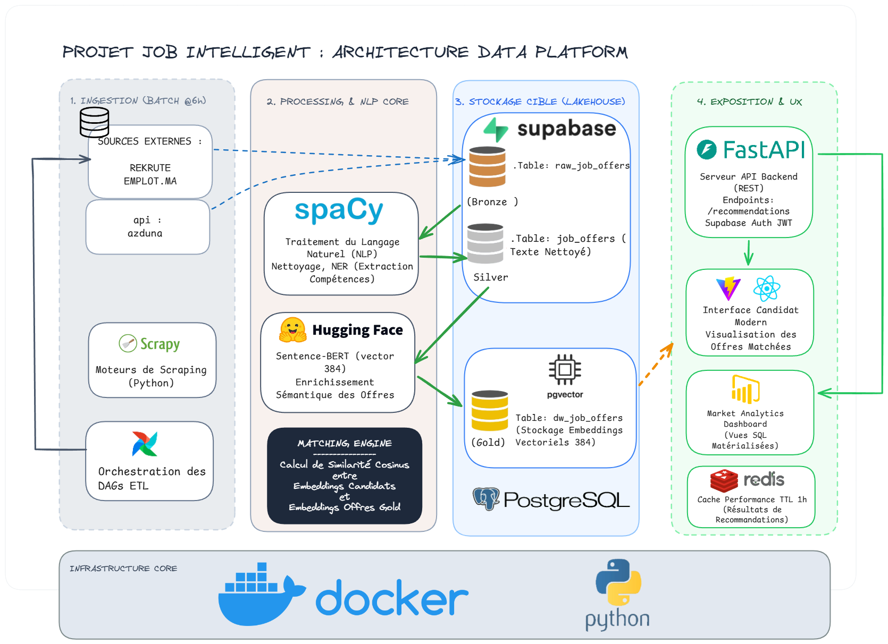

<div align="center">

# Job Intelligent

**AI-Powered Job Matching Platform for Data Professionals**

[](https://python.org)
[](https://fastapi.tiangolo.com)
[](https://react.dev)
[](https://typescriptlang.org)
[](https://postgresql.org)
[](https://docker.com)

</div>

---

## What It Does

Job Intelligent aggregates data-domain job offers from multiple sources, runs them through a 3-layer ETL pipeline, and matches them to candidate profiles using Sentence-BERT embeddings and a multi-signal scoring engine — all served through a REST API and a React SaaS interface.

**Core capabilities:**
- **Aggregate** — APIs (Adzuna, JSearch, France Travail) + web scrapers (Rekrute, Emploi.ma, WelcomeToTheJungle), unified into one pipeline
- **Match** — Sentence-BERT embeddings + pgvector cosine search + skill overlap scoring
- **Explain** — Every recommendation includes matched skills, missing skills, and a score breakdown
- **Serve** — FastAPI REST backend + React SPA with dark/light mode

---

## Architecture



The platform is organized into four stages:

| Stage | Components |
|---|---|
| **Ingestion** | Job APIs (Adzuna, JSearch, France Travail) + Scrapy spiders, orchestrated by Airflow every 6h |
| **Processing & NLP** | spaCy NER for skill extraction · Sentence-BERT for 384-dim embeddings · multi-signal matching engine |
| **Storage (Lakehouse)** | Supabase (PostgreSQL 15 + pgvector): Bronze → Silver → Gold with embeddings |
| **Exposition** | FastAPI REST backend · React SPA · Analytics dashboard · Redis cache (TTL 1h) |

```
┌─────────────────────────────────────────────────────────┐
│                     DATA INGESTION                       │
│  Job APIs (primary)        Scrapy Spiders (fallback)     │
│  Adzuna · JSearch          Rekrute · Emploi.ma           │
│  France Travail            WelcomeToTheJungle            │
└──────────────────────┬──────────────────────────────────┘
                       │ normalized JobItem
                       ▼
┌─────────────────────────────────────────────────────────┐
│                   ETL PIPELINE (Airflow)                 │
│  Bronze (raw_job_offers)                                 │
│    → Silver (job_offers)      NLP · dedup · taxonomy     │
│      → Gold (dw_job_offers)   embeddings · demand score  │
│  Every stage logged to pipeline_runs                     │
└──────────────────────┬──────────────────────────────────┘
                       │ PostgreSQL 15 + pgvector (Supabase)
                       ▼
┌─────────────────────────────────────────────────────────┐
│                  BACKEND API (FastAPI)                   │
│  Routers → Services → Repositories → Supabase           │
│  Auth · Jobs · Candidates · Recommendations · Search     │
│  Redis cache · JWT auth · Rate limiting                  │
└──────────────────────┬──────────────────────────────────┘
                       │ REST / JSON
                       ▼
┌─────────────────────────────────────────────────────────┐
│                FRONTEND (React + TypeScript)             │
│  Dashboard · Job Search · Recommendations · Skill Gap   │
│  TanStack Query · Zustand · Tailwind CSS · Shadcn UI    │
└─────────────────────────────────────────────────────────┘
```

---

## Tech Stack

| Layer | Technology | Version |
|---|---|---|
| Backend API | FastAPI + Uvicorn | 0.111 |
| Data validation | Pydantic v2 | 2.7 |
| Database | Supabase (PostgreSQL 15) | 15 |
| Vector search | pgvector · HNSW index | 0.7 |
| NLP | spaCy `fr_core_news_md` | 3.7 |
| Embeddings | Sentence-BERT `all-MiniLM-L6-v2` (384d) | — |
| Cache | Redis | 7 |
| Orchestration | Apache Airflow | 2.9 |
| Scraping | Scrapy | 2.11 |
| Frontend | React 18 + TypeScript 5 + Vite | — |
| UI | Tailwind CSS + Shadcn UI | — |
| State | TanStack Query + Zustand | 5 / 4 |
| Auth | python-jose (JWT HS256) + passlib (bcrypt) | — |
| Infrastructure | Docker Compose | — |

---

## Features

| Feature | Description |
|---|---|
| **Job Search** | Filter by location, contract type, with pagination |
| **Semantic Search** | Natural language query → pgvector similarity match |
| **Recommendations** | Scored job matches with skill overlap explanation |
| **Skill Gap** | Shows which skills to acquire for target roles |
| **Candidate Profile** | Skills, title, experience, location, salary expectation |
| **Saved Jobs** | Bookmark and manage job offers |
| **Dark / Light Mode** | System-aware theme, persisted via Zustand |

---

## Quick Start

### Prerequisites

- Docker Desktop (Compose v2)
- A free [Supabase](https://supabase.com) project

### 1 — Environment

```bash
git clone <repo-url>
cd job-intelligent
cp .env.example .env   # fill in values below
```

Required variables:

```env
SUPABASE_URL=https://your-project.supabase.co
SUPABASE_KEY=your-service-role-key
JWT_SECRET_KEY=generate-a-long-random-string
```

Optional (enables API ingestion):

```env
ADZUNA_APP_ID=...
ADZUNA_APP_KEY=...
JSEARCH_API_KEY=...
FRANCE_TRAVAIL_CLIENT_ID=...
FRANCE_TRAVAIL_CLIENT_SECRET=...
```

### 2 — Database Migrations

Run these in order in your Supabase SQL Editor:

```
sql/001_schema.sql              Core tables, RLS, indexes
sql/002_functions.sql           match_job_offers() pgvector RPC
sql/003_materialized_views.sql  Analytics views
sql/004_candidate_and_product.sql  Candidate tables
sql/005_candidate_functions.sql    Candidate matching functions
sql/006_pipeline_monitoring.sql    ETL monitoring
sql/007_recommendation_history.sql Recommendation history + semantic search
sql/008_schema_fixes.sql           Patches (triggers, RLS, column fixes)
```

### 3 — Start

```bash
docker compose up -d
```

| Service | URL |
|---|---|
| API + Swagger | http://localhost:8000/docs |
| Airflow | http://localhost:8080 (admin / admin) |

### 4 — Run ETL

Open Airflow UI → enable `job_etl` DAG → trigger manually.

### 5 — Tests

```bash
docker compose exec fastapi python -m pytest tests/ -v
```

---

## API Overview

### Auth

| Method | Endpoint | Description |
|---|---|---|
| POST | `/api/v1/auth/register` | Create account |
| POST | `/api/v1/auth/login` | Get JWT token |
| GET | `/api/v1/auth/me` | Current user |

### Jobs

| Method | Endpoint | Description |
|---|---|---|
| GET | `/api/v1/jobs` | List/search (paginated) |
| GET | `/api/v1/jobs/{id}` | Job detail |
| POST | `/api/v1/jobs/{id}/save` | Save job |
| DELETE | `/api/v1/jobs/{id}/save` | Unsave job |

### Candidates

| Method | Endpoint | Description |
|---|---|---|
| GET | `/api/v1/candidates/profile` | Get own profile |
| POST | `/api/v1/candidates/profile` | Create profile |
| PUT | `/api/v1/candidates/profile` | Update profile |
| POST | `/api/v1/candidates/cv` | Upload CV (multipart) |
| GET | `/api/v1/candidates/saved-jobs` | Saved jobs list |

### AI

| Method | Endpoint | Description |
|---|---|---|
| POST | `/api/v1/recommendations` | Get scored job matches |
| GET | `/api/v1/candidates/{id}/skill-gap` | Skill gap analysis |
| GET | `/api/v1/search?q=...` | Semantic job search |

All endpoints return:

```json
// Single resource
{ "id": "...", "title": "Data Engineer" }

// Paginated list
{ "items": [...], "total": 1256, "page": 1, "per_page": 20, "pages": 63 }

// Error
{ "detail": "Job not found", "code": "JOB_NOT_FOUND" }
```

Full documentation: **http://localhost:8000/docs**

---

## Repository Structure

```
job-intelligent/
├── api/                    FastAPI application
│   ├── core/               Config, security, exceptions
│   ├── middleware/         Request ID, rate limiting, error handler
│   ├── models/             Domain schemas (recommendation engine)
│   ├── repositories/       Data access (one file per table)
│   ├── routers/            Endpoint definitions
│   ├── schemas/            Pydantic request/response models
│   └── services/           Business logic
├── ai_services/            Standalone AI modules
│   ├── cv_parser/          PDF/DOCX extraction + NLP enrichment
│   ├── embedding/          Sentence-BERT embedding generator
│   └── matching/           Scorer · explainer · skill gap
├── etl/                    ETL pipeline modules
│   ├── ingest.py           Bronze ingestion
│   ├── transform.py        Silver transformation
│   ├── enrich.py           Gold enrichment + embeddings
│   ├── dedup.py            Cross-source deduplication
│   ├── taxonomy.py         Job category classification
│   ├── monitoring.py       Pipeline run tracking
│   └── skill_normalization.py  Canonical skill dictionary
├── airflow/dags/           job_etl DAG definition
├── ingestion/api_clients/  Adzuna · JSearch · France Travail clients
├── scrapers/               Scrapy spiders (Rekrute, Emploi.ma, WTTJ)
├── frontend/src/           React SPA
│   ├── pages/              Dashboard · Jobs · Recommendations · Profile
│   ├── components/         Shared UI components
│   ├── hooks/              TanStack Query hooks
│   ├── store/              Zustand stores (auth, theme)
│   └── services/           API client (centralized fetch wrapper)
├── sql/                    Database migrations (001 → 008)
├── tests/                  Unit · integration · ETL · API tests
└── docs/                   Architecture and design documents
```

---

## Configuration Reference

All config loads from env vars via Pydantic `BaseSettings` (`api/core/config.py`).

| Variable | Required | Default | Notes |
|---|---|---|---|
| `SUPABASE_URL` | Yes | — | Project URL |
| `SUPABASE_KEY` | Yes | — | Service-role key |
| `JWT_SECRET_KEY` | Yes | `change-me` (warns) | Long random string |
| `REDIS_URL` | No | `redis://localhost:6379/0` | |
| `SBERT_MODEL` | No | `all-MiniLM-L6-v2` | |
| `SPACY_MODEL` | No | `fr_core_news_md` | |
| `JWT_EXPIRE_MINUTES` | No | `60` | |
| `MAX_CV_SIZE_BYTES` | No | `5242880` | 5 MB |
| `CORS_ALLOWED_ORIGINS` | No | `http://localhost:3000` | Comma-separated |

---

## Docs

- [Architecture](docs/architecture.md) — System design and data flow
- [Data Platform](docs/data-platform.md) — Bronze / Silver / Gold pipeline
- [AI System](docs/ai-system.md) — Embeddings, matching, explainability
- [Backend](docs/backend.md) — FastAPI structure, services, auth
- [Frontend](docs/frontend.md) — React pages, state, theme

---

*Built for data professionals. 2026 — Job Intelligent.*

