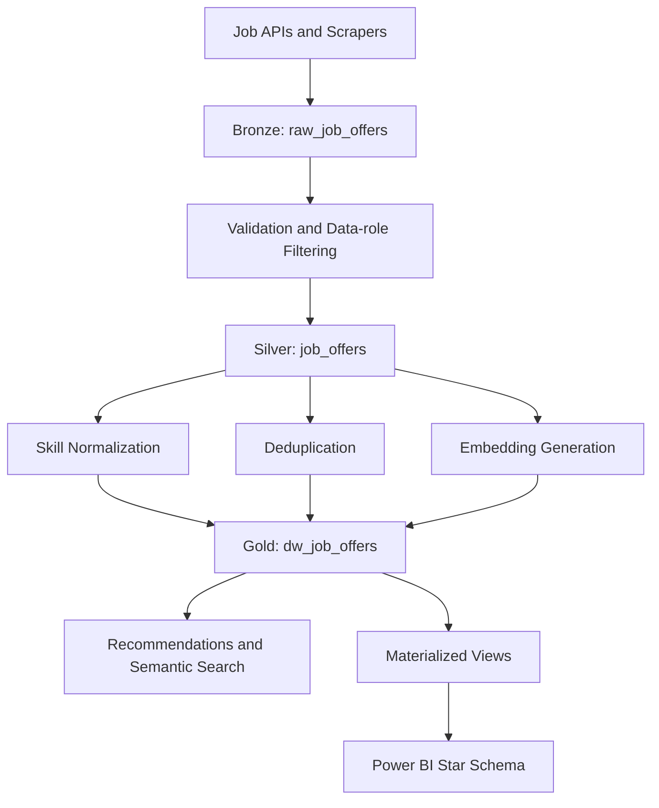
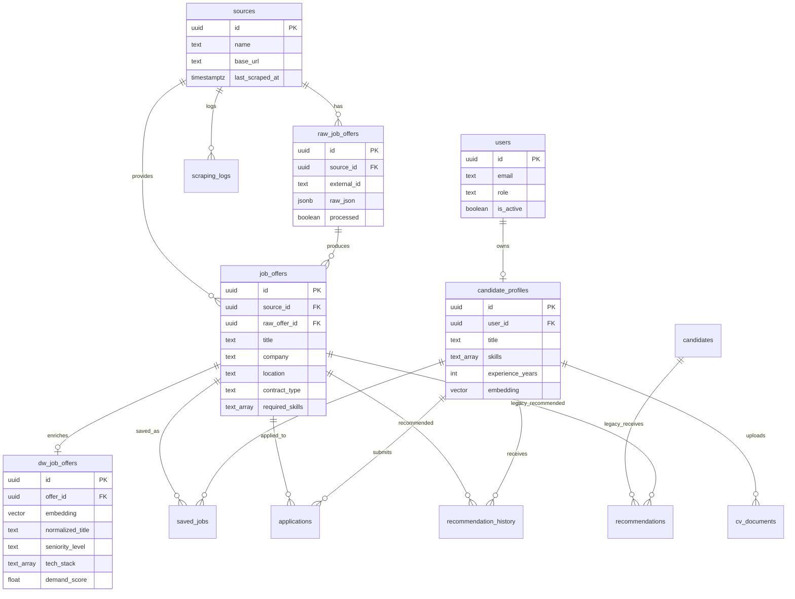
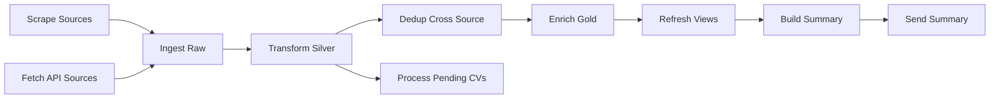

# Project Report — Job Intelligent

**Repository:** `Ridadata/job-intelligent`  
**Branch analyzed:** `feature/amine-dev`  
**Latest inspected commit:** `dc625a42a23b8838fe8630d2f3fa7535c8419fa1`  
**Report date:** 2026-05-17

This report is based on the files present in the inspected repository tree. When a capability is not fully implemented in code, it is explicitly described as a planned or recommended improvement.

## 1. Executive Summary

Job Intelligent is an intelligent job-search and job-profile matching platform focused on data-related careers such as Data Engineer, Data Scientist, Machine Learning Engineer, Analytics Engineer, BI Analyst, and related roles.

The project addresses a real market problem: data professionals often need to search across fragmented job boards, inconsistent job descriptions, and heterogeneous salary, skill, and contract information. Job Intelligent centralizes job offers, normalizes them through a structured data pipeline, enriches them with NLP and vector embeddings, and exposes them through a FastAPI backend and React SaaS-style frontend.

From an engineering perspective, the project is positioned as a data platform rather than only a CRUD application. It implements a Bronze -> Silver -> Gold data architecture, stores operational and analytical data in PostgreSQL/Supabase, uses pgvector for semantic search, and prepares analytical views and a Power BI star schema for business intelligence. It also includes candidate profiles, saved jobs, CV parsing, recommendation history, pipeline observability, and local data-migration tooling.

The result is a serious end-to-end data engineering and AI SaaS project: ingestion, transformation, enrichment, matching, APIs, UI, analytics, infrastructure, and testing are all represented in the repository.

## 2. Context and Motivation

The job-search process for data professionals is fragmented across multiple sources: job-board APIs, company portals, regional platforms, and scraped websites. Job descriptions often use inconsistent vocabulary for the same concepts, for example `BI`, `Business Intelligence`, `Power BI`, `Data Analyst`, or `Analytics Engineer`. This makes simple keyword search insufficient.

For candidates, the important question is not only whether a job contains a keyword, but whether the role semantically matches their profile, skills, seniority, location preference, and career direction. For business users, the platform also creates value by turning job-market data into analytical insights: skill demand, hiring companies, locations, salary ranges, source performance, and market trends over time.

Job Intelligent is motivated by this dual need:

| Need | Platform response |
|---|---|
| Fragmented job data | Centralized ingestion from APIs and scrapers |
| Inconsistent job descriptions | Normalization, taxonomy, and canonical skill processing |
| Keyword search limitations | Embeddings and pgvector semantic similarity |
| Poor explainability | Matched skills, missing skills, score breakdowns, and skill gap analysis |
| BI and decision support | Gold layer, materialized views, Power BI star schema |
| Cloud quota and cost constraints | Local PostgreSQL/Supabase export strategy for BI and demos |

## 3. Project Objectives

### Functional Objectives

- Aggregate job offers for data-related roles from multiple sources.
- Store raw, cleaned, and enriched data in separate layers.
- Allow users to register, authenticate, and manage a candidate profile.
- Support job search, filtering, saved jobs, semantic search, recommendations, and skill-gap analysis.
- Parse uploaded CV files and use extracted information to improve candidate profiles.
- Provide administrative visibility into users, platform statistics, and pipeline runs.

### Technical Objectives

- Implement a Bronze -> Silver -> Gold data architecture inspired by data warehouse and lakehouse patterns.
- Use PostgreSQL/Supabase as the operational database and pgvector for vector similarity search.
- Generate 384-dimensional Sentence-BERT embeddings for jobs and candidate profiles.
- Use FastAPI as a secure backend layer between frontend clients and the database.
- Build a React/TypeScript frontend with query caching, persistent auth state, and reusable UI components.
- Provide ETL orchestration through Airflow and observable pipeline run tracking.
- Prepare BI-ready materialized views, CSV exports, and a Power BI star schema.

### Business and Product Objectives

- Help data professionals discover better-fit roles faster.
- Make recommendations explainable through visible score components and skill evidence.
- Turn job-market data into decision-ready analytics for role demand, skills, companies, salaries, and locations.
- Demonstrate production-oriented thinking around cost control, quotas, local resilience, and BI workload isolation.

## 4. Scope of the Project

### Implemented in the Inspected Repository

- API ingestion clients for Adzuna, JSearch, and France Travail.
- Airflow orchestration currently calling Adzuna and JSearch API sources, plus Rekrute and Emploi.ma spiders.
- Bronze, Silver, and Gold SQL schemas with indexes, materialized views, and pgvector support.
- FastAPI backend with auth, jobs, candidates, recommendations, search, admin, and health routers.
- Candidate profile, CV document, saved jobs, applications, recommendation history, and pipeline monitoring tables.
- React frontend pages for landing, login, register, dashboard, job search, job detail, recommendations, skill gap, profile, saved jobs, and admin views.
- NLP and matching modules for skill extraction, skill normalization, embeddings, scoring, explainability, and skill gaps.
- Power BI materialized views, CSV exports, dashboard specifications, and star-schema SQL.
- Docker Compose infrastructure including local Supabase stack, Airflow, Redis, and FastAPI.
- CI and tests for API clients, ETL, NLP, embeddings, data coherence, pipeline integration, and recommendations.

### Planned or Recommended Improvements

- Wire the France Travail client into the Airflow DAG if it is intended to run in the scheduled pipeline.
- Add more robust production scraping and source-health monitoring.
- Move CV file storage from local disk to Supabase Storage or another durable object store.
- Add model versioning for embeddings.
- Add deeper ranking-model evaluation and monitoring.
- Add stronger production deployment, secrets management, and observability.

### Outside Current Scope

- Employer-side applicant tracking workflows.
- Payments, subscriptions, or billing.
- Full production MLOps lifecycle with model registry and online evaluation.
- Guaranteed live availability of third-party job sources.

## 5. Global Architecture

Job Intelligent follows a layered architecture. External job sources feed an ingestion layer. Airflow coordinates ingestion, transformation, deduplication, enrichment, and analytics refresh. Supabase PostgreSQL stores both operational and analytical structures. The FastAPI backend exposes controlled APIs to the React frontend, while the Gold and Power BI layers support analytics.

```mermaid
flowchart LR
    subgraph Sources[External Job Sources]
        Rekrute[Rekrute Spider]
        Emploi[Emploi.ma Spider]
        Adzuna[Adzuna API]
        JSearch[JSearch API]
        FranceTravail[France Travail Client]
    end

    subgraph Orchestration[Airflow ETL Orchestration]
        Scrape[Scrape / Fetch]
        Ingest[Ingest Raw Offers]
        Transform[Bronze to Silver]
        Dedup[Cross-source Deduplication]
        Enrich[Silver to Gold Enrichment]
        Refresh[Refresh Analytics Views]
        CVTask[Pending CV Processing]
    end

    subgraph Database[Supabase PostgreSQL + pgvector]
        Bronze[(Bronze: raw_job_offers)]
        Silver[(Silver: job_offers)]
        Gold[(Gold: dw_job_offers)]
        Product[(Users, Profiles, Saved Jobs, History)]
        Views[(Materialized Views + Power BI Views)]
    end

    subgraph Backend[FastAPI Backend]
        Auth[Auth API]
        Jobs[Jobs API]
        Candidates[Candidate API]
        Search[Semantic Search API]
        Recs[Recommendation API]
        Admin[Admin API]
    end

    subgraph Frontend[React SaaS Frontend]
        Dashboard[Dashboard]
        JobSearch[Job Search]
        Profile[Profile + CV Upload]
        Recommendations[Recommendations]
        SkillGap[Skill Gap]
        AdminUI[Admin Views]
    end

    PowerBI[Power BI / BI Consumers]

    Sources --> Scrape --> Ingest --> Bronze --> Transform --> Silver --> Dedup --> Enrich --> Gold --> Refresh --> Views
    Transform --> CVTask --> Product
    Product --> Backend
    Gold --> Backend
    Silver --> Backend
    Backend --> Frontend
    Views --> PowerBI
```

Key architectural characteristics:

- **Separation of concerns:** ingestion, ETL, AI services, backend APIs, frontend UI, and BI are separated into distinct folders and responsibilities.
- **Backend-mediated database access:** frontend code calls FastAPI services rather than querying the database directly.
- **Analytical readiness:** Power BI receives curated views instead of raw operational tables.
- **Operational resilience:** local Supabase/PostgreSQL migration scripts reduce dependency on cloud quotas during BI demos and development.

## 6. Data Architecture

The project uses a Bronze -> Silver -> Gold approach, which is common in modern data warehouse, lakehouse, and medallion-style data architectures.

| Layer | Main table(s) | Purpose |
|---|---|---|
| Bronze | `raw_job_offers` | Preserve raw source payloads as JSONB, with source lineage and processing state. |
| Silver | `job_offers` | Store cleaned, normalized, data-domain-only job offers with consistent fields and required skills. |
| Gold | `dw_job_offers` | Store enriched matching-ready records with embeddings, normalized title, seniority, category, tech stack, demand score, and dedup key. |
| Analytics | `mv_*`, `powerbi.*` views | Support dashboards, Power BI models, and market analysis. |

Bronze keeps source fidelity. Silver makes records operationally usable. Gold makes records analytically and AI-ready. This is directly related to data warehouse/lakehouse thinking because the platform separates ingestion truth, cleaned business entities, and consumption-ready analytical products.

Important data engineering decisions visible in the code:

- Bronze uses `(source_id, external_id)` uniqueness to prevent duplicate raw ingestion.
- Silver filters the domain to data and AI roles using role and technology keywords.
- Silver normalizes contract type, salary values, descriptions, and extracted skills.
- Gold adds vector embeddings and enriched dimensions for matching and analytics.
- Pipeline stages are logged in `pipeline_runs` with row counts, errors, timings, and status.

## 7. Database Design

The database is implemented through SQL migration files in `sql/`. The schema combines operational product tables, ETL observability, vector search, and BI support.

### Main Tables

| Table | Role |
|---|---|
| `sources` | Registered job sources with base URL and last scrape timestamp. |
| `raw_job_offers` | Bronze raw JSON payloads from each source. |
| `job_offers` | Silver cleaned job offers used by APIs and frontend search. |
| `dw_job_offers` | Gold enriched offers with embeddings and matching/analytics fields. |
| `users` | Application user accounts with roles. |
| `candidate_profiles` | Candidate profile data used for recommendations and skill-gap analysis. |
| `cv_documents` | Uploaded CV metadata, parsing status, raw text, and parsed fields. |
| `saved_jobs` | Candidate bookmarks for job offers. |
| `applications` | Basic candidate application tracking table. |
| `recommendation_history` | Recommendation events and score breakdowns. |
| `pipeline_runs` | ETL observability and run metrics. |
| `scraping_logs` | Source-level scraping status and row counts. |
| `candidates`, `recommendations` | Earlier/legacy candidate and recommendation tables from the initial schema. Current product logic primarily uses `users`, `candidate_profiles`, and `recommendation_history`. |

### Materialized Views and BI Views

The repository includes materialized views for analytics:

- `mv_offers_by_skill`
- `mv_salary_by_role`
- `mv_offers_by_location`
- `mv_market_trends`
- `mv_top_companies`

The Power BI star schema defines:

- Dimensions: `powerbi.dim_date`, `powerbi.dim_source`, `powerbi.dim_contract`, `powerbi.dim_company`, `powerbi.dim_location`, `powerbi.dim_role`, `powerbi.dim_skill`
- Facts: `powerbi.fact_job_offers`, `powerbi.fact_skill_demand`, `powerbi.fact_recommendation_events`, `powerbi.fact_pipeline_runs`

### ERD

### Indexing and Vector Search

The schema includes indexes for common filters and analytical workloads, including:

- GIN index on `job_offers.required_skills` for skill overlap queries.
- HNSW/vector index on `dw_job_offers.embedding` for pgvector similarity search.
- Indexes on source, contract, location, seniority, category, dedup key, recommendation history, and pipeline run fields.
- Unique indexes on materialized views to support concurrent refresh.

## 8. Backend Architecture

The backend is a FastAPI application organized around routers, services, repositories, schemas, middleware, and shared core utilities.

### Router Layer

| Router | Prefix | Responsibility |
|---|---|---|
| `auth.py` | `/api/v1/auth` | Register, login, current user. |
| `jobs.py` | `/api/v1/jobs` | Paginated job listing, detail, save, unsave. |
| `candidates.py` | `/api/v1/candidates` | Profile CRUD, CV upload, saved jobs. |
| `recommendations.py` | `/api/v1` | Recommendations and candidate skill gap endpoint. |
| `search.py` | `/api/v1` | Semantic job search. |
| `admin.py` | `/api/v1/admin` | Pipeline runs, users, platform stats; admin role required. |
| `health.py` | `/health`, `/readiness` | Liveness and readiness checks. |

### Service Layer

The service layer contains business logic:

- `AuthService` handles registration, password hashing, login, and token generation.
- `JobService` handles job lookup, listing, saved jobs, and candidate resolution.
- `CandidateService` handles profiles, profile completeness, embeddings, CV upload, and background parsing.
- `recommendation_service.py` orchestrates candidate lookup, embedding generation, pgvector matching, scoring, explanation, and recommendation history.
- `search_service.py` converts search queries into embeddings and calls vector search.
- `skill_gap_service.py` aggregates missing skills from semantically similar jobs.
- `redis_service.py` provides cache helpers.

### Repository Layer

Repository classes centralize database access through the Supabase client:

- `JobRepository`
- `CandidateRepository`
- `SavedJobsRepository`
- `CVDocumentRepository`
- `UserRepository`

A notable optimization is the use of explicit selected columns instead of broad `select(*)` calls in high-traffic repository methods. This is important because embedding vectors and raw CV text can be large and expensive to transfer.

### Security and Configuration

- JWTs are created and decoded through `api/core/security.py`.
- Password hashing uses passlib/bcrypt.
- `get_current_user` validates locally issued JWTs and includes a Supabase Auth fallback.
- `require_role` enforces admin access for admin endpoints.
- Configuration uses Pydantic settings loaded from environment variables.
- Middleware includes request IDs, error handling, CORS, and rate limiting.

The current dependency factory creates a Supabase client using `SUPABASE_URL` and `SUPABASE_KEY`. The configuration also contains `DATABASE_MODE` and `LOCAL_DATABASE_URL`, which support the broader local migration and demo strategy, although the FastAPI dependency still uses the Supabase client abstraction.

## 9. Frontend Architecture

The frontend is a React 18, TypeScript, and Vite single-page application. It uses a SaaS-style authenticated layout with protected routes and admin-only routes.

### Main Pages

| Page | Purpose |
|---|---|
| `Landing.tsx` | Public entry page. |
| `Login.tsx`, `Register.tsx` | Authentication flows. |
| `Dashboard.tsx` | Overview of jobs, recommendations, saved jobs, and market insights. |
| `JobSearch.tsx` | Search and filter job offers. |
| `JobDetail.tsx` | Detailed job view. |
| `Recommendations.tsx` | Personalized recommendation display. |
| `Profile.tsx` | Candidate profile management and CV upload. |
| `SavedJobs.tsx` | Candidate saved jobs. |
| `SkillGap.tsx` | Missing skills and improvement priorities. |
| `admin/*` | Admin dashboard, pipeline status, and user management. |

### State and API Integration

- TanStack Query is used for server-state fetching, caching, invalidation, and mutation workflows.
- Zustand stores authentication state, filters, and theme preferences.
- A centralized API client injects the bearer token into requests and normalizes error handling.
- Services encapsulate frontend API calls for auth, jobs, candidates, and recommendations.
- Protected routes enforce authenticated access, and admin routes enforce role-based access in the UI.

### UI and UX Choices

The frontend uses Tailwind CSS, reusable UI components, lucide-react icons, and framer-motion animations. The user experience is organized around practical job-search workflows: search, save, complete profile, upload CV, receive recommendations, and analyze skill gaps.

## 10. NLP and Matching Engine

The NLP and matching system combines deterministic skill matching with semantic vector similarity.

### Embeddings

The repository uses Sentence-BERT, specifically `all-MiniLM-L6-v2`, to generate 384-dimensional embeddings. Job embeddings are created from title, description, and skills. Candidate embeddings are created from title, skills, and experience-related profile text.

Embeddings are stored in PostgreSQL using pgvector:

- Job embeddings: `dw_job_offers.embedding`
- Candidate embeddings: `candidate_profiles.embedding`

### pgvector Similarity Search

The SQL function `match_job_offers` computes cosine similarity using pgvector distance and returns matching jobs above a threshold. The backend repository calls this function through Supabase RPC.

The semantic search endpoint follows this flow:

1. User submits a natural-language query.
2. Backend generates a query embedding.
3. Backend calls pgvector matching through `match_job_offers`.
4. Results are returned with similarity scores and job metadata.

### Multi-signal Recommendation Scoring

Recommendations are not based only on vector similarity. The project implements a weighted composite scorer:

| Signal | Weight |
|---|---:|
| Skill overlap | 0.5 |
| Embedding similarity | 0.3 |
| Seniority alignment | 0.1 |
| Location preference | 0.1 |

Skill overlap uses normalized fuzzy matching, including exact matches, substring matching, separator handling, and version suffix cleanup. The recommendation service ranks jobs by composite score and includes matched skills, missing skills, and a score breakdown.

### Explainability and Skill Gap

`ai_services/matching/explainer.py` generates human-readable explanations from matched skills, missing skills, and score components. `ai_services/matching/skill_gap.py` aggregates missing skills across recommended or similar jobs to identify learning priorities.

### CV Parsing

The candidate workflow supports PDF and DOCX CV uploads. Text extraction uses PyPDF2 and python-docx. The enrichment module extracts skills, years of experience, and education level using a high-precision hybrid approach based on canonical skills and regex patterns.

### Honest Implementation Status

- Semantic matching and weighted scoring are implemented.
- Candidate embeddings and job embeddings are implemented.
- Skill gap analysis is implemented.
- Advanced model training, model versioning, online learning, and ranking evaluation are recommended future improvements.

## 11. ETL / ELT Pipeline

The ETL/ELT pipeline is orchestrated by Airflow in `airflow/dags/job_etl_dag.py`. The DAG is scheduled every 6 hours and follows the pipeline:

### Ingestion

Implemented ingestion paths include:

- Rekrute Scrapy spider.
- Emploi.ma Scrapy spider.
- Adzuna API client.
- JSearch API client.
- France Travail API client exists in the repository; the inspected DAG currently orchestrates Adzuna and JSearch in the API-fetch task.

The DAG includes seed data fallback when live scraping returns no results, which is a pragmatic development and demo strategy for keeping the downstream pipeline testable.

### Bronze Loading

`etl/ingest.py` upserts raw job offers into `raw_job_offers` using `(source_id, external_id)` as the conflict key. It stores the full raw payload in JSONB and sets `processed = false` for downstream transformation.

### Silver Transformation

`etl/transform.py` processes unprocessed Bronze rows, filters to data/AI roles, normalizes contract type and salary fields, extracts skills, normalizes skill names, validates rows with Pydantic schemas, and inserts results into `job_offers`.

### Gold Enrichment

`etl/enrich.py` reads Silver jobs not yet enriched, validates job quality, generates embeddings in batch, classifies seniority and job category, normalizes titles, computes a demand score, builds dedup keys, and upserts into `dw_job_offers`.

### Deduplication and Quality

The repository contains hash-based and fuzzy deduplication in `etl/dedup.py`, validation schemas in `etl/validation.py`, quality checks in `etl/quality_checks.py`, and canonical skill mapping in `etl/skills_canonical.json` and `etl/skill_normalization.py`.

### Observability

`etl/monitoring.py` logs stage execution to `pipeline_runs`, including input rows, output rows, skipped rows, error rows, duration, metadata, and status. This supports both operational debugging and admin dashboard visibility.

## 12. Analytics and BI Layer

The Gold layer and materialized views support analytical workloads and Power BI dashboards. The project contains both direct database modeling and CSV export support.

### Implemented Analytics Assets

- Materialized views in `sql/003_materialized_views.sql`.
- Power BI star-schema SQL in `powerbi/star_schema.sql`.
- Power BI relationship guide in `powerbi/star_schema.md`.
- Dashboard specifications and DAX measures in `powerbi/dashboard_specs.md` and `powerbi/dax_measures.md`.
- CSV exports in `powerbi/exports/` and an export script in `powerbi/export_to_csv.py`.
- Local Power BI connection guide using local Supabase/PostgreSQL through `localhost:54322`.

### Proposed KPIs

| KPI | Source / logic |
|---|---|
| Number of job offers by role | Gold normalized title or `powerbi.dim_role` and `fact_job_offers`. |
| Offers by location | `mv_offers_by_location` or `powerbi.dim_location`. |
| Most requested skills | `mv_offers_by_skill` or `fact_skill_demand`. |
| Salary trends | `mv_salary_by_role` where salary fields are available. |
| Top companies | `mv_top_companies`. |
| Contract type distribution | `job_offers.contract_type` or `powerbi.dim_contract`. |
| Market trends over time | `mv_market_trends` or date dimension joined to facts. |
| Recommendation save rate | `fact_recommendation_events` with action values such as `shown` and `saved`. |
| ETL success rate | `fact_pipeline_runs` by status. |

The BI design is professional because it separates operational tables from analytical facts and dimensions, supports refresh strategies, and documents relationship grain.

## 13. Deployment and Infrastructure

The project contains a Docker-based local development and demo infrastructure.

### Main Infrastructure Elements

- `Dockerfile` for the FastAPI application image.
- `Dockerfile.airflow` for Airflow with ETL, ingestion, scraping, pipeline, and AI service modules copied into the image.
- `docker-compose.yml` with local Supabase services, Airflow, Redis, and FastAPI.
- Supabase local stack files under `infra/supabase/`, including database scripts, gateway/proxy configuration, Deno functions, pooler setup, and service volumes.
- `.env.example` documenting Supabase, local PostgreSQL, JWT, Redis, Airflow, NLP model, CV size, and API key configuration.
- GitHub Actions CI running Python setup, spaCy model download, pytest, and coverage for `etl` and `api`.

### Environment and Configuration

Important environment variables include:

- `SUPABASE_URL`
- `SUPABASE_KEY`
- `SUPABASE_DB_URL`
- `LOCAL_DATABASE_URL`
- `DATABASE_MODE`
- `JWT_SECRET_KEY`
- `REDIS_URL`
- `SBERT_MODEL`
- `SPACY_MODEL`
- API credentials for Adzuna, JSearch, and France Travail.

### Migration and Local Snapshot Tooling

The repository includes two migration strategies:

- Direct database snapshot via `scripts/migrate_supabase_to_local.ps1`, using `pg_dump` and `pg_restore` inside Docker.
- REST-based data migration via `scripts/migrate_data.py`, designed to bypass certain direct database connectivity issues.

Verification and SQL application scripts include:

- `scripts/verify_local_snapshot.ps1`
- `scripts/apply_sql_to_supabase.ps1`
- `sql/009_local_dev_post_restore.sql`

## 14. Supabase Quota and Professional Mitigation Strategy

Supabase was used as the cloud operational database during development. This is a reasonable choice because Supabase provides managed PostgreSQL, REST access, authentication ecosystem support, and pgvector compatibility.

However, cloud database free plans naturally include quota, bandwidth, connection, and egress constraints. In this project, those constraints are treated as operational design inputs rather than weaknesses.

Professional mitigation strategies visible or recommended in the repository include:

| Constraint | Mitigation |
|---|---|
| Large vectors and payloads increase egress | Repository methods use explicit column selection and avoid unnecessary embedding transfer. |
| Analytical workloads can overload operational DB access | Power BI can use local PostgreSQL/Supabase snapshots or curated exports. |
| `select(*)` can return large columns unintentionally | Use targeted selects for jobs, candidates, saved jobs, and CV document listings. |
| BI tools may repeatedly query large tables | Use materialized views, star-schema views, import mode, or controlled DirectQuery. |
| Demo reliability depends on cloud availability | Migrate cloud data to local PostgreSQL/Supabase and connect Power BI locally. |
| API pagination and payload size | Backend job listing and saved jobs endpoints use pagination. |
| Repeated expensive calls | Redis caching support exists for backend responses. |

This strategy reflects cost control and production-readiness. Analytical workloads are separated from operational usage, query payloads are optimized, and local PostgreSQL/Supabase snapshots enable reliable demos even when cloud quotas are constrained.

## 15. Architecture Decision Records

### ADR-001 — Choose Bronze/Silver/Gold Architecture

**Status:** Accepted  
**Context:** Job data arrives from multiple heterogeneous sources with inconsistent fields, missing values, duplicate records, and noisy descriptions.  
**Decision:** Use a Bronze -> Silver -> Gold architecture with `raw_job_offers`, `job_offers`, and `dw_job_offers`.  
**Consequences:** Raw lineage is preserved, cleaned operational data is separated from enriched matching-ready data, and BI consumers can rely on curated outputs. This adds more pipeline complexity but makes the project more maintainable and analytically credible.  
**Alternatives considered:** A single `jobs` table; direct ingestion into frontend-facing tables; external data lake storage before PostgreSQL.

### ADR-002 — Choose Supabase PostgreSQL as Operational Database

**Status:** Accepted  
**Context:** The project needs relational storage, JSONB for raw payloads, PostgreSQL extensions, REST-friendly access, and a fast development setup.  
**Decision:** Use Supabase PostgreSQL as the main operational database during development.  
**Consequences:** The platform benefits from managed PostgreSQL, REST/Supabase client access, and pgvector support. Free-plan quotas and egress constraints require careful query design and local BI mitigation.  
**Alternatives considered:** Plain local PostgreSQL only; MongoDB; BigQuery-only architecture; hosted data warehouse first.

### ADR-003 — Use pgvector for Semantic Search

**Status:** Accepted  
**Context:** Job descriptions and candidate profiles cannot be matched reliably using only keywords. The platform needs vector similarity search near the operational data.  
**Decision:** Store embeddings in PostgreSQL using pgvector and use SQL/RPC functions such as `match_job_offers`.  
**Consequences:** Semantic search remains close to the relational model and can join enriched jobs with metadata. Query performance depends on vector indexes and careful payload selection.  
**Alternatives considered:** External vector databases; in-memory similarity search; keyword-only PostgreSQL search.

### ADR-004 — Use Sentence-BERT Embeddings for Job-Profile Matching

**Status:** Accepted  
**Context:** Matching should understand semantic similarity across job titles, descriptions, and skills.  
**Decision:** Use Sentence-BERT `all-MiniLM-L6-v2` to generate 384-dimensional embeddings for jobs, candidates, and natural-language search queries.  
**Consequences:** The approach is lightweight, practical for local development, and compatible with pgvector. It is not a fully trained ranking model, so composite scoring and future evaluation remain important.  
**Alternatives considered:** TF-IDF; spaCy vectors only; OpenAI embeddings; custom supervised ranking model.

### ADR-005 — Use FastAPI Backend Instead of Direct Frontend Database Access

**Status:** Accepted  
**Context:** The frontend needs authentication, business logic, recommendations, CV upload, and controlled data access. Direct database access would expose too much data and push business logic into the client.  
**Decision:** Use a FastAPI backend layer with routers, services, repositories, schemas, middleware, and role checks.  
**Consequences:** Security, validation, and business logic are centralized. The backend can optimize payloads, add caching, and hide database details. It requires maintaining an API layer.  
**Alternatives considered:** Direct Supabase client from React; serverless-only functions; monolithic frontend/backend framework.

### ADR-006 — Use React, TypeScript, Vite, TanStack Query, and Zustand

**Status:** Accepted  
**Context:** The product requires a modern SaaS interface with authenticated workflows, reusable components, and responsive data fetching.  
**Decision:** Use React with TypeScript and Vite, TanStack Query for server state, and Zustand for client state such as auth, filters, and theme.  
**Consequences:** The frontend is modular, type-aware, and ergonomic for dashboards and job-search workflows. The team must maintain consistency across services, hooks, and UI components.  
**Alternatives considered:** Next.js; Vue; server-rendered templates; direct Supabase UI prototypes.

### ADR-007 — Use Local PostgreSQL/Supabase Export for BI and Demo Resilience

**Status:** Accepted  
**Context:** BI tools can generate repeated, heavy queries and can exceed cloud free-plan quotas or create unreliable demos when connected directly to cloud data.  
**Decision:** Support migration/export from Supabase cloud to a local PostgreSQL/Supabase stack and connect Power BI to local curated data when appropriate.  
**Consequences:** The demo and BI layer become resilient and cost-controlled. Data freshness depends on migration or export cadence when using local/import mode.  
**Alternatives considered:** Always connect Power BI directly to Supabase cloud; CSV-only BI; move all analytics to a separate cloud data warehouse.

### ADR-008 — Use Power BI for Business Analytics

**Status:** Accepted  
**Context:** The project needs to demonstrate business value beyond application features: job-market demand, salaries, locations, sources, and skill trends.  
**Decision:** Prepare materialized views, CSV exports, dashboard specs, DAX measures, and a `powerbi.*` star schema for Power BI.  
**Consequences:** The BI layer is aligned with standard enterprise analytics practices. It introduces a second consumption path that must stay aligned with schema changes.  
**Alternatives considered:** React-only analytics dashboard; Metabase; Superset; notebooks only.

### ADR-009 — Optimize Egress and Query Payloads

**Status:** Accepted  
**Context:** Embeddings, raw CV text, and raw JSON payloads can make API responses large and expensive. Cloud quota and egress constraints make this important even in development.  
**Decision:** Prefer explicit column selection, pagination, response caching, and curated BI views over broad table reads.  
**Consequences:** API responses are smaller, faster, and more cloud-friendly. Developers must keep repository selects aligned with schemas and avoid reintroducing broad `select(*)` calls.  
**Alternatives considered:** Ignore payload size until production; move all traffic to local only; rely entirely on frontend filtering.

## 16. Software Engineering Best Practices

The repository demonstrates several strong engineering practices:

- **Modularity:** backend routers, services, repositories, schemas, middleware, ETL modules, AI services, frontend services, hooks, stores, and pages are separated by responsibility.
- **Separation of concerns:** ingestion, transformation, enrichment, serving, presentation, and analytics are distinct layers.
- **Configuration management:** environment variables are documented in `.env.example` and loaded through Pydantic settings in the backend.
- **Database migration discipline:** SQL files are versioned and additive, with schema fixes and post-restore scripts included.
- **Observability:** pipeline runs and scraping logs capture execution state, row counts, errors, and durations.
- **Testing:** tests cover API clients, NLP, ETL, validation, embeddings, pipeline integration, data coherence, and recommendations.
- **Security practices:** JWT handling, password hashing, role-based admin protection, and backend-mediated database access are implemented.
- **Maintainability:** repository and service layers reduce duplication and make future changes easier.

## 17. Limitations

The following limitations are visible from the repository and should be framed professionally:

- Third-party APIs and scraped websites can be unreliable, rate-limited, or blocked. The Airflow DAG includes seed fallback data for demo and validation continuity.
- The inspected DAG orchestrates Adzuna and JSearch API sources. A France Travail client exists but should be wired into the scheduled DAG if required.
- The inspected spider folder contains Rekrute and Emploi.ma spiders. Other sources mentioned in broader documentation should be treated as planned unless implemented in code.
- Salary fields are optional and may be missing or inconsistent across sources, so salary analytics depend on available data quality.
- Candidate profiles may be incomplete until the user enters data or uploads a CV.
- CV files are stored locally through `cv_upload_dir`; durable object storage is recommended before production.
- Semantic matching uses embeddings and weighted heuristics, not a supervised ranking model trained on user outcomes.
- Supabase free-plan quota and egress constraints require careful query design and local BI strategies.
- Local BI snapshots trade real-time freshness for reliability and cost control.

## 18. Future Improvements

Recommended professional improvements include:

- Add stronger ingestion contracts and source adapters with consistent retry, backoff, and source-health reporting.
- Wire all intended API clients into Airflow, including France Travail if it remains part of the source strategy.
- Add Airflow task-level data quality gates and alerting.
- Add model versioning columns for embeddings and track embedding generation metadata.
- Add evaluation datasets for recommendation relevance and ranking quality.
- Add CV parsing confidence scores and improved entity extraction.
- Move CV storage to Supabase Storage or another durable object store.
- Add per-user or per-route rate limits for expensive AI endpoints.
- Add production caching strategy for recommendations, search, and dashboard metrics.
- Harden authentication and authorization for production deployment.
- Expand the BI semantic model with certified measures, incremental refresh, and row-level security if needed.
- Add Dockerized production deployment documentation and environment-specific secret management.

## 19. Conclusion

Job Intelligent is a well-structured data engineering and AI application for the job-search domain. It goes beyond a basic job board by implementing a complete pipeline from source ingestion to normalized data, enriched semantic matching, user-facing recommendations, and analytical BI outputs.

Technically, the project demonstrates meaningful data platform concepts: medallion-style data layers, vector search, ETL orchestration, schema-driven validation, API layering, frontend state management, and BI modeling. Product-wise, it creates value for data professionals by improving discovery, explainability, and skill-gap awareness. From a learning and engineering perspective, it is a strong demonstration of how data engineering, AI/NLP, backend systems, frontend UX, and analytics can be integrated into one coherent SaaS-style platform.

The Supabase quota/local PostgreSQL strategy is not a weakness. It is a mature engineering decision: keep cloud services useful for development and operational access, while moving BI and demo workloads to local or curated analytical paths when cost, reliability, or egress control matters.

## Repository Evidence

The report was inferred from the following repository evidence in the inspected branch:

| Area | Evidence |
|---|---|
| Project overview | `README.md`, `docs/ARCHITECTURE.md`, `docs/data-platform.md`, `docs/ai-system.md`, `docs/backend.md`, `docs/frontend.md`, `docs/PROJECT_BACKLOG.md` |
| Database schema | `sql/001_schema.sql`, `sql/002_functions.sql`, `sql/003_materialized_views.sql`, `sql/004_candidate_and_product.sql`, `sql/005_candidate_functions.sql`, `sql/006_pipeline_monitoring.sql`, `sql/007_gold_schema_update.sql`, `sql/007_recommendation_history.sql`, `sql/008_schema_fixes.sql`, `sql/009_local_dev_post_restore.sql` |
| Backend | `api/main.py`, `api/routers/*`, `api/services/*`, `api/repositories/*`, `api/core/*`, `api/middleware/*`, `api/models/schemas.py`, `api/schemas/*` |
| ETL and orchestration | `etl/*`, `airflow/dags/job_etl_dag.py`, `pipeline/cleaning/job_cleaner.py` |
| AI and NLP | `ai_services/embedding/generator.py`, `ai_services/matching/*`, `ai_services/cv_parser/*`, `etl/nlp.py`, `etl/skill_normalization.py`, `etl/skills_canonical.json`, `etl/taxonomy.py` |
| Ingestion sources | `ingestion/api_clients/adzuna_client.py`, `ingestion/api_clients/jsearch_client.py`, `ingestion/api_clients/france_travail_client.py`, `scrapers/job_scrapers/spiders/rekrute_spider.py`, `scrapers/job_scrapers/spiders/emploi_ma_spider.py` |
| Frontend | `frontend/package.json`, `frontend/src/App.tsx`, `frontend/src/pages/*`, `frontend/src/components/*`, `frontend/src/hooks/*`, `frontend/src/services/*`, `frontend/src/store/*`, `frontend/src/config/*`, `frontend/src/types/*` |
| BI and analytics | `powerbi/star_schema.sql`, `powerbi/star_schema.md`, `powerbi/dashboard_specs.md`, `powerbi/dax_measures.md`, `powerbi/export_to_csv.py`, `powerbi/exports/*`, `powerbi/connection_guide.md`, `powerbi/local_connection_guide.md` |
| Infrastructure | `docker-compose.yml`, `Dockerfile`, `Dockerfile.airflow`, `.env.example`, `infra/supabase/*`, `scripts/*`, `.github/workflows/ci.yml` |
| Tests | `tests/test_api_clients.py`, `tests/test_data_coherence.py`, `tests/test_embeddings.py`, `tests/test_etl.py`, `tests/test_nlp.py`, `tests/test_phase3.py`, `tests/test_pipeline_integration.py`, `tests/test_recommendations.py` |
